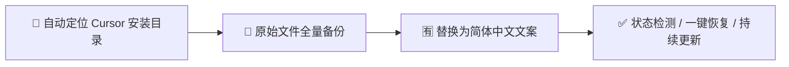

# Cursor 汉化精灵


   


> **cursor-hanhua-jingling** — Cursor IDE 界面一键汉化工具

将 Cursor IDE 的专有英文界面替换为简体中文，支持最新版 Cursor 3.x 全部界面区域。
基于开源项目 [cursor-i18n-zh](https://github.com/baishi1114010/cursor-i18n-zh) 扩展完善。

> ⚠️ 非官方工具，与 Cursor 团队无关。工具会修改本地安装文件，请自行评估风险。
> 所有原始文件都会先备份到用户目录，随时可以一键恢复英文原版。

---

## 🔄 汉化流程



## ✨ 功能覆盖

| 区域 | 汉化内容 |
|------|----------|
| **Cursor Settings** | General、账号、外观、套餐与用量、智能体、工作树、工具与 MCP、钩子、Git 与 PR、模型、规则技能、索引、网络、测试功能等全部页面 |
| **Glass 主页** | 新建智能体、自动化、规划新想法、多任务模式等 |
| **Automations 自动化** | 自动化列表、模板、触发器、MCP、运行历史等 |
| **Appearance 外观** | 主题、颜色、字体排版、工具调用密度、动效等 |
| **Agent 聊天** | 常用操作按钮、模式切换、提示文案、队列消息设置等 |
| **VS Code 基础 UI** | 通过中文语言包汉化 File / Edit / 命令面板 / 右键菜单等 |

---

## 🔧 环境要求

- **Node.js** ≥ 18（[下载地址](https://nodejs.org/)）
- **Cursor IDE**（Windows / macOS / Linux）
- 无需 `npm install` —— 本项目零依赖

---

## 🚀 快速开始

### 方式一：双击启动脚本（推荐）

1. 双击运行 `汉化精灵.bat`
2. 选择 `[3] 查看汉化状态` 确认工具能找到 Cursor
3. **完全退出 Cursor IDE**（右下角托盘图标也要退出）
4. 选择 `[1] 一键汉化`
5. 等待显示"🎉 汉化完成"
6. 重新打开 Cursor，界面即为中文

### 方式二：命令行

```bash
cd cursor-hanhua-jingling

# 1. 完全退出 Cursor

# 2. 一键汉化（自动检测安装路径）
node index.js localize

# 路径检测失败时手动指定：
node index.js localize -p "D:\你的路径\cursor\resources\app"

# 3. 重启 Cursor 完成
```

---

## 📖 命令参考

| 命令 | 作用 |
|------|------|
| `node index.js localize` | 一键汉化（含 VS Code 语言包配置） |
| `node index.js restore` | 恢复英文原版 |
| `node index.js status` | 查看汉化状态与 Cursor 版本 |
| `node index.js locale` | 仅配置 VS Code 中文语言包 |
| `node scripts/audit.js` | 自检优先词条覆盖率 |
| `node index.js help` | 显示帮助 |

通用选项：

| 选项 | 说明 |
|------|------|
| `-p, --path <目录>` | 手动指定 Cursor 安装路径（指向 `resources\app` 或其上级） |

也可使用 npm scripts：

```bash
npm run localize    # 一键汉化
npm run restore     # 恢复原版
npm run status      # 查看状态
npm run audit       # 覆盖率自检
```

---

## ⚙️ 工作原理

```
┌─────────────────────────────────────────────────────────────┐
│                     Cursor 汉化精灵                           │
├─────────────────────────────────────────────────────────────┤
│  1. 检测 Cursor 安装路径与版本                                │
│     （支持默认位置自动检测，或 -p 手动指定）                   │
│  2. 配置 VS Code 中文语言包（locale.json → zh-cn）            │
│  3. 备份原始文件 → ~/.cursor-i18n-zh/backups/<版本>/          │
│  4. 按字典对 JS 打包文件做安全字符串替换                       │
│  5. 修复 product.json 完整性校验 Hash                         │
│  6. macOS: 清除隔离属性 + 本地重签名                          │
└─────────────────────────────────────────────────────────────┘
```

### 汉化的目标文件

| 文件 | 内容 |
|------|------|
| `workbench.desktop.main.js` | Settings、Agent 聊天等 |
| `workbench.glass.main.js` | Glass 主页、Appearance 等 |
| `workbench.anysphere-ui-automations.js` | Automations 页面 |
| `product.json` | 校验 Hash 修复 |

### 三层翻译引擎（防止白屏的安全设计）

字典分三类，避免误替换导致界面白屏：

1. **安全长句**（`dict.js` 等）
   在引号内全局替换完整短语，如 `"Privacy Mode"` → `"隐私模式"`。
   只有带引号的完整字符串才会被替换，绝不会碰到代码逻辑。

2. **危险短词**（`riskyShortWords`）
   `Open`、`Add` 这类单词到处都可能出现，因此只在明确的 UI 属性上下文中替换，
   如 `label:"Open"`、`description:"..."` 或 JSX 文本节点。

3. **特殊规则**（`tricky.js`、`settings-nav.js`）
   处理三元表达式、模板字符串、Settings 导航映射等非常规格式，
   例如 `e.isGlass?"Code Intelligence":"索引与文档"` 这类内嵌逻辑。

替换顺序：安全长句 → 特殊规则 → 危险短词（长词条优先匹配，避免截断）。

### 备份机制

- 备份存放在用户目录，**不在** Cursor 安装目录内（避免 macOS EPERM 权限问题）
- 路径：`~/.cursor-i18n-zh/backups/<Cursor版本>/`
- 状态记录：`~/.cursor-i18n-zh/state.json`
- 重复运行 `localize` 时会自动从备份还原到干净状态再重新汉化，不会叠加替换

---

## ❓ 常见问题

### Cursor 更新后界面变回英文？

大版本更新会覆盖被修改的文件，重新运行一键汉化即可：

```bash
node index.js localize
# 或双击 汉化精灵.bat 选 [1]
```

### 提示"未找到 Cursor 安装目录"？

Cursor 安装在非默认位置时手动指定路径：

```bash
node index.js status -p "D:\你的路径\cursor\resources\app"
```

查看状态确认路径正确后再执行 localize。

### 提示"检测到 Cursor 仍在运行"？

汉化必须修改静态文件，请彻底退出 Cursor：

1. 关闭所有 Cursor 窗口
2. 检查系统托盘（右下角）是否有 Cursor 图标，右键退出
3. 任务管理器中确认没有 `Cursor.exe` 进程

### 权限不足 / EPERM？

- Windows：右键 `汉化精灵.bat` → 以管理员身份运行
- macOS：在弹出的授权框输入密码，或手动 `sudo node index.js localize`

### 如何恢复英文？

```bash
node index.js restore -p "D:\你的路径\cursor\resources\app"
# 或双击 汉化精灵.bat 选 [2]
```

然后重启 Cursor。

### 还有界面没翻译怎么办？

在 `src/dict.js`（或 `dict-automations.js`、`dict-appearance.js`、`dict-settings-pages.js`）中添加条目：

```javascript
'English text here': '中文翻译',
```

运行 `npm run audit` 验证覆盖率，然后重新执行 localize。

### 汉化后某个页面白屏/异常？

```bash
node index.js restore   # 先恢复英文原版
```

然后在 [Issues](https://github.com/baishi1114010/cursor-i18n-zh/issues) 反馈具体词条。

---

## ⚠️ 已知限制

- 服务端动态下发的文案（部分套餐页、模板描述）无法本地汉化
- 每次 Cursor **版本更新**后需重新汉化
- 品牌名（GitHub、Slack、MCP、LSP 等）按惯例保留英文
- 设置搜索框中的英文别名（aliases）不翻译，以保证英文搜索可用
- 非官方方式，不在 Cursor 官方支持范围内

---

## 📁 项目结构

```
cursor-hanhua-jingling/
├── index.js                 # CLI 入口
├── package.json
├── 汉化精灵.bat              # Windows 双击启动脚本（GBK 编码）
├── scripts/
│   └── audit.js             # 覆盖率自检
└── src/
    ├── platform.js          # 路径检测、提权、运行状态
    ├── backup.js            # 外部目录备份/还原
    ├── hash.js              # product.json 校验修复
    ├── translate.js         # 核心翻译引擎
    ├── locale.js            # VS Code 语言包配置
    ├── tricky.js            # 特殊格式正则替换
    ├── settings-nav.js      # Settings 侧栏导航映射
    ├── dict.js              # 主翻译字典
    ├── dict-automations.js  # Automations 专用字典
    ├── dict-appearance.js   # Appearance 专用字典
    └── dict-settings-pages.js # Settings 各页面补全字典
```

数据目录（不在项目内）：

```
~/.cursor-i18n-zh/
├── state.json               # 汉化状态记录
└── backups/<Cursor版本>/     # 每个版本的原始文件备份
```

---

## 📝 版本历史

### v1.2.0（2026-07-26）

根据 Cursor 3.13 Settings 截图补全遗漏词条：侧栏 Git 与拉取请求/浏览器与网络、套餐用量重置模板、智能体白名单/LSP 全套、工作树 Max Worktrees、模型任务模型与 Explore 子智能体、Git 分支前缀、规则第三方配置、索引 Ignore Files 等。

详见 `docs/UPDATE-v1.2.0.md`。

### v1.1.0（2026-07-10）

补全 Settings 七大页面汉化（账号公开资料、外观动效、套餐用量、智能体运行模式、工作树清理策略、工具与 MCP 团队服务器、钩子迁移横幅）。详见 `docs/UPDATE-v1.1.0.md`。

### 中文增强版（本仓库）

在 v1.2.0 基础上针对 Cursor 3.17 实测补充：

- 设置页新词条：窗口恢复、继续中断的智能体、头像、名/姓、用户名、链接、默认模型、新消息、队列手动发送、礼花炮、代码智能、跟随系统高对比度、语音提交关键字、浏览器链接打开方式等
- 修复 `Run Mode (Enforced by ...)` 大小写变体、PR 链接描述无 in 变体、Reduce Transparency/Motion 系统提示等漏翻场景
- 审计脚本 `scripts/audit.js` 支持 `-p` 参数指定安装路径
- 提供 Windows 双击启动脚本 `汉化精灵.bat`

---

## 🤝 如何贡献翻译

1. Fork 本仓库，找到对应字典文件添加词条
2. 运行 `npm run audit` 确认无遗漏
3. 提交 Pull Request

词条书写规范：

```javascript
// 安全长句：完整短语，首字母大写保持原文大小写
'Default Model': '默认模型',

// 描述句：包含标点符号的完整句子
'What model new agents use by default': '新智能体默认使用的模型',
```

---

## 📄 许可证

[MIT](LICENSE)

## 🙏 致谢

翻译引擎思路参考社区项目 [cursor-i18n-tool](https://github.com/Wuyf5275/cursor-i18n-tool)；
本项目基于 [cursor-i18n-zh](https://github.com/baishi1114010/cursor-i18n-zh) 扩展了 Glass、Automations、Appearance 等模块并持续完善词条。
